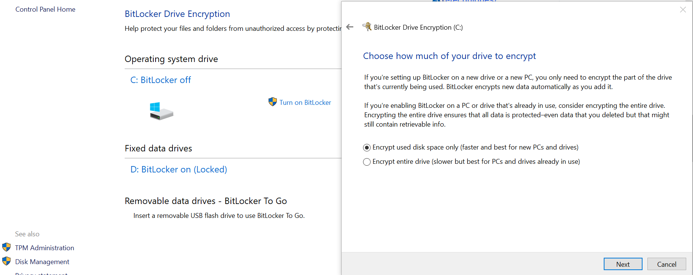
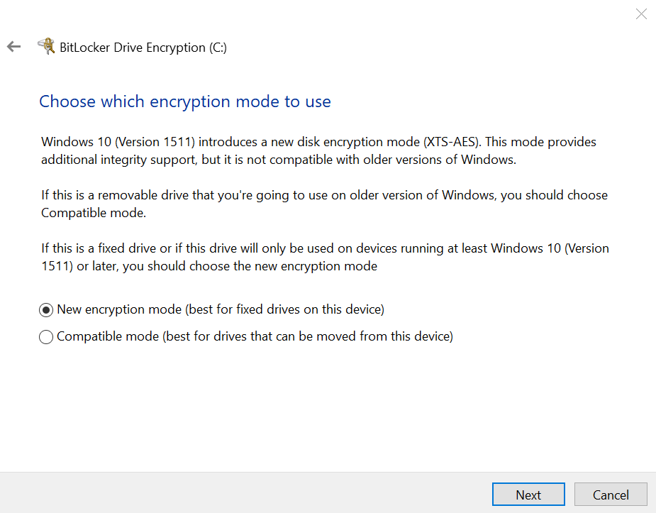
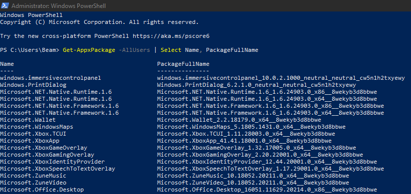
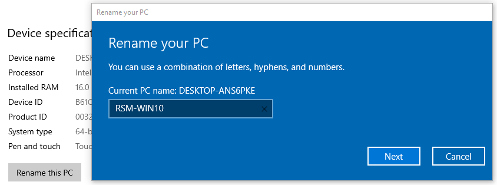
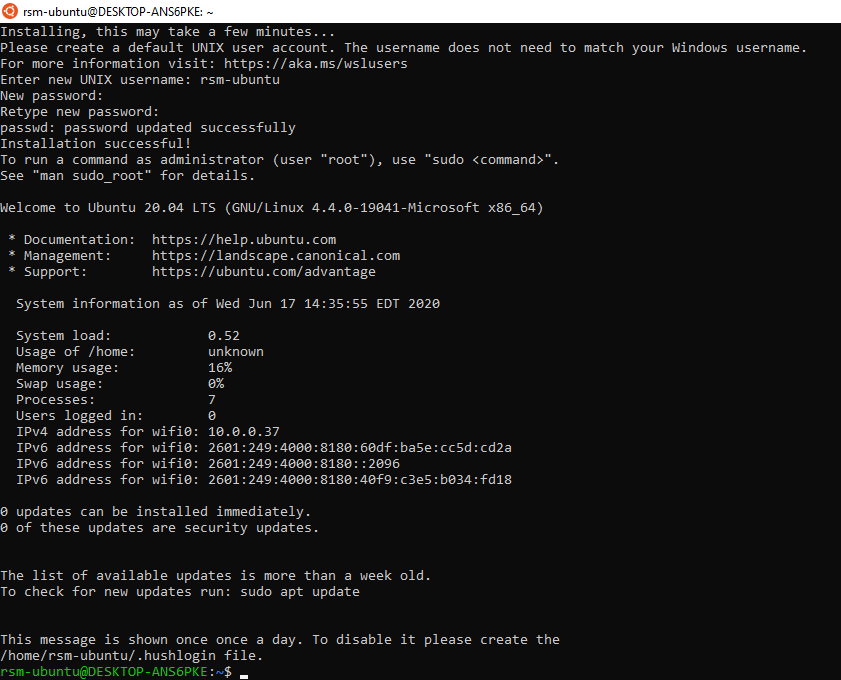
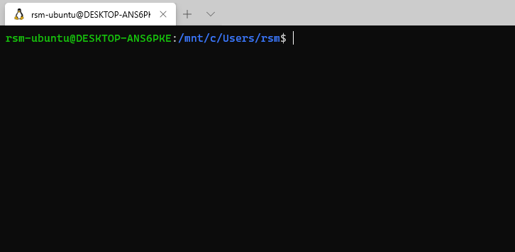
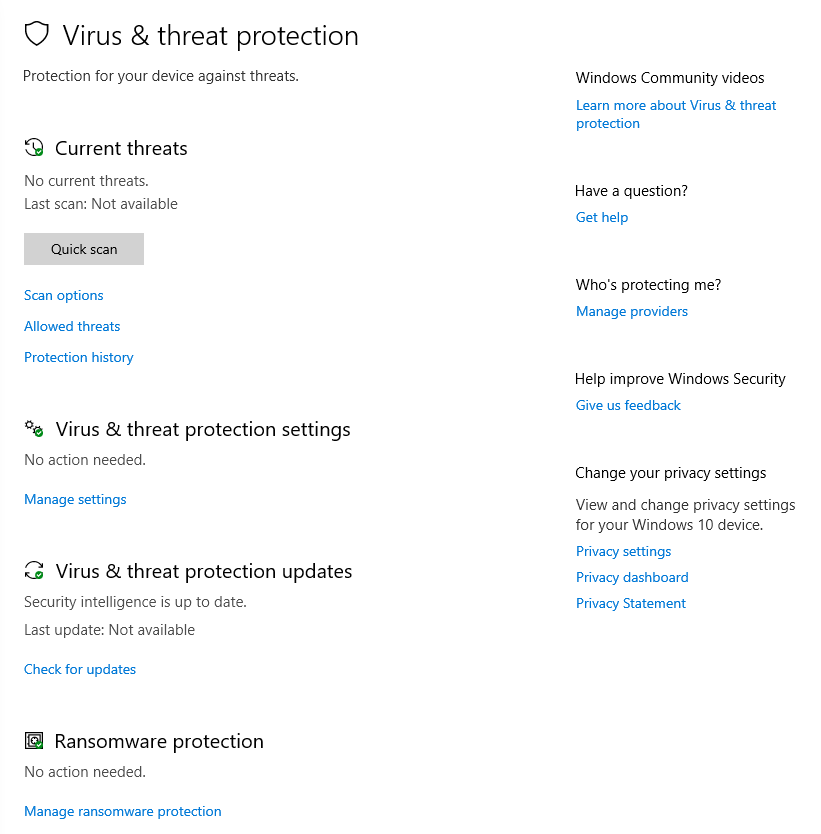
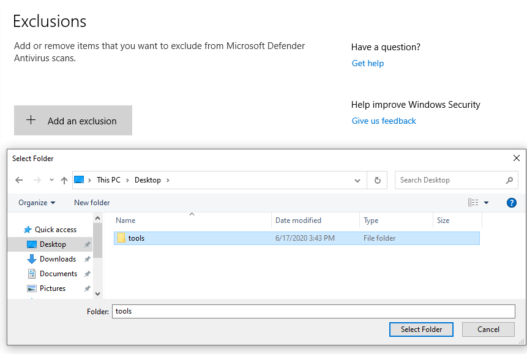
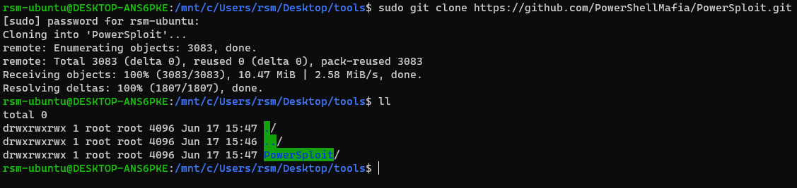
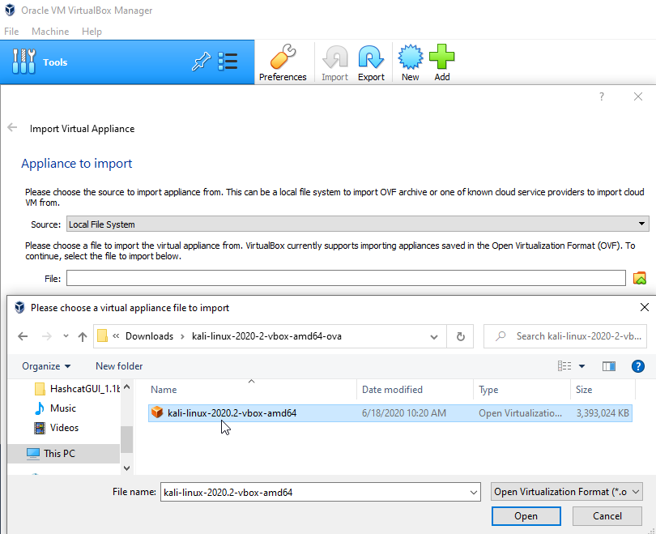

# Building a Testing Laptop on Windows

## Installing Windows from ISO

In some offices, the Laptop provided to testers already has stock Windows 10 installed. If your device already boots up to a Windows installation menu, you can skip this step.

Reach out to your Lab Manager if you need a Windows 10 installation ISO or product key. Some Lab Managers may have a Windows 10 installer USB you can borrow. 

> For the purposes of this guide we are using the Windows 10 Enterprise Evaluation image: [https://www.microsoft.com/en-us/evalcenter/evaluate-windows-10-enterprise](https://www.microsoft.com/en-us/evalcenter/evaluate-windows-10-enterprise)

Once you have installed the ISO to a USB drive, shut down the target device and boot it while pressing F1, F12, or F10 to enter the boot menu and select the USB device for boot.

> Lenovo ThinkPad users press enter when the Lenovo logo appears and then F12

The following installation steps are recommended:

* Select Language \(English\).
* Select Install.
* Select Custom Installation.
* Select the target drive \(usually unallocated space, but you may need to erase/partition your drive\).
* Windows installation begins and will boot a few times.
* Select a network and connect to it.
* An O365 account is not needed, just enter an _invalid_ email address and choose to create a local account.
* Setup local username and a strong password of at least 12 characters.
* Choose preferred privacy settings and then complete installation.
* Eventually the device will reboot and you are prompted to login to Windows.

## General Hardening

### Enable BitLocker

Start Menu &gt; search "Manage BitLocker" &gt; Turn on BitLocker



Select the default options and allow the computer to restart



BitLocker is now enabled.


### Enable Secure Boot

On Lenovo ThinkPads you can enter the BIOS by pressing enter on boot when the Lenovo logo appears and then F1. Then go to **Security** &gt; **Secure Boot** &gt; **Secure Boot Enabled.** 


### Disable NetBIOS/LLMNR

Start Menu &gt; search "View network connections" &gt; Enter


Right click on the Ethernet network adapter and select **Properties**. Select **Internet Protocol Version 4**, and then press the **Properties** button.

Click the **Advanced** button to open the Advanced TCP/IP Settings window. Then select the **WINS** tab. Finally, select **Disable NetBIOS over TCP/IP**.


Repeat this process for all other relevant network adapters such as **WIFI**. Note: there are ways that this can be performed via command line or registry options.

### Removing Preinstalled Programs

#### Powershell

Run PowerShell as Administrator. List all installed packages:

```bash
Get-AppxPackage -AllUsers | Select Name, PackageFullName
```



To remove a package, copy the PackageFullName into this command:

```bash
#Get-AppxPackage <package name> | Remove-AppxPackage
Get-AppxPackage Microsoft.XboxApp_41.41.18001.0_x64__8wekyb3d8bbwe | Remove-AppxPackage
```

Look at the output of packages and remove them based on your own discretion \(example: Candy Crush\). Here are some common default programs to remove:

```text
Get-AppxPackage *skypeapp* | Remove-AppxPackage
Get-AppxPackage *zunemusic* | Remove-AppxPackage
Get-AppxPackage *windowsmaps* | Remove-AppxPackage
Get-AppxPackage *solitairecollection* | Remove-AppxPackage
Get-AppxPackage *bingfinance* | Remove-AppxPackage
Get-AppxPackage *zunevideo* | Remove-AppxPackage
Get-AppxPackage *bingnews* | Remove-AppxPackage
Get-AppxPackage *windowsphone* | Remove-AppxPackage
Get-AppxPackage *bingsports* | Remove-AppxPackage
Get-AppxPackage *xboxapp* | Remove-AppxPackage
```

#### Windows Apps & Features 

Start menu &gt; search "Add or remove programs" &gt; Enter


Here you can also select programs and remove them.

### Change Hostname

Start Menu &gt; search "About your PC" &gt; Enter



Select **Rename this PC**. ****Select a new hostname.

## Installing Programs

> Testers are not required to follow these methods or install any of this software. These are recommendations.

### Ninite

Ninite is a great tool for installing many programs at once.



Select the programs you would like to install and select **Get Your Ninite**:


Run the downloaded file and allow Ninite to make changes to your device. It will begin installing your programs. Once Ninite is complete, the new applications will be installed.

### Greenshot

Greenshot is screenshot software for Windows that can be downloaded through Ninite or at [https://getgreenshot.org/](https://getgreenshot.org/). During testing engagements, it can be useful for taking screenshots with the **PrtSc** key and then selecting a screen region. It can also be used for obfuscating screenshots with the built-in image editor:


### Windows Subsystem for Linux \(WSL\)

WSL allows you to interact with your Windows system using a bash shell \( [https://docs.microsoft.com/en-us/windows/wsl/install-win10](https://docs.microsoft.com/en-us/windows/wsl/install-win10)\).

To install WSL, open PowerShell as Administrator and enter:

```bash
dism.exe /online /enable-feature /featurename:Microsoft-Windows-Subsystem-Linux /all /norestart
```

You should see the following:


Then find a distribution of Linux you like in the Microsoft store, I will use Ubuntu 20.04 LTS \([https://www.microsoft.com/en-us/p/ubuntu-2004-lts/9n6svws3rx71?rtc=1](https://www.microsoft.com/en-us/p/ubuntu-2004-lts/9n6svws3rx71?rtc=1)\). Note: Kali Linux is also an option

After installing the package through the Windows store, restart your computer and run Ubuntu \(or chosen Linux distro\). Create your username/password and you will have a working Linux shell.



###  Windows Terminal

Windows terminal makes using WSL prettier and feel more like Linux. It is also installed from the Microsoft store: [https://www.microsoft.com/en-us/p/windows-terminal/9n0dx20hk701](https://www.microsoft.com/en-us/p/windows-terminal/9n0dx20hk701)

Install it and run it. If you want to make WSL your default terminal, press `Ctrl+,` \(comma\) and then change the GUID of the default profile to the GUID of the Ubunutu shell in the _profiles_ portion of the settings. 


Save the file and restart Windows Terminal. You should have a fully functional Linux shell for your Windows file system. Note: the `C:\` drive is located at `/mnt/c/`



### Additional Programs and Hacking Tools

Install any other programs you may need. From within WSL you can pull down Github repositories to your Windows file system using `git clone ...`. We recommend putting all of your tools within a single Windows directory and create a Windows Defender exception on that directory so that they can be run without causing security issues.

> Please use Windows Defender exceptions at your own risk

Start Menu &gt; search "Virus & Threat Protection" &gt; Enter



Select **Manage Settings** then **Add or remove exclusions**. Then add the path to hacking tools:



After this this exclusion has been created, you can download tools to this path without triggering AV. For example PowerSploit does not get flagged:



> Once again, use AV exclusions with caution.

#### Hashcat

Because the Windows system is running on the metal, it makes sense to use hashcat in Windows opposed to a VM. You can download the hashcat binaries here: [https://hashcat.net/hashcat/](https://hashcat.net/hashcat/)

After extracting the files and opending a shell in the folder, `hashcat.exe`can be used:


#### Hashcat GUI

The Hashcat GUI for Windows is a useful tool for running hashcat. It can be downloaded here: [https://hashkiller.io/downloads/](https://hashkiller.io/downloads/)

You have to configure the Hashcat Path within the application to point to your hashcat.exe binary:


This application is simply a wrapper for hashcat.exe and will spawn a cmd window when the cracking has started.

## Installing a Virtual Machine

### VirtualBox

First you will need to download the latest version of Oracle VM VirtualBox from [https://www.virtualbox.org/wiki/Downloads](https://www.virtualbox.org/wiki/Downloads).

Once installed you will need to find a VM image for Kali Linux from the Offensive Security official releases: [https://www.offensive-security.com/kali-linux-vm-vmware-virtualbox-image-download/](https://www.offensive-security.com/kali-linux-vm-vmware-virtualbox-image-download/)


These can only be downloaded via Torrent clients like uTorrent.

> You do not have to use Kali Linux for testing. Testers are given the freedom to use any distro they prefer, such as Ubuntu or Debian.

Once downloaded, open Virtual Box and select **Import &gt;** **File Folder Icon &gt; Your** .**ova File for Kali Linux:**



The appliance can be imported with the default settings. 

#### RAM and Processors

Dedicated RAM and processor resources can be changed later. We recommend giving your VM at least 4GB of RAM for the best performance. This can be done by right clicking on the VM and selecting **Settings &gt; System &gt; Motherboard &gt; Base Memory.** 


Processor cores can also be selected in this menu under **Processor.** 

**Networking**

Still within Settings, the **Network** tab is important for setting the network configuration of the VM. If you are working remotely and need to use a VPN hosted by your Windows host, NAT will be needed to use the tunneling interface.


 If you are testing on an internal network, **Bridge Adapter** is usually the best choice as it will allow you to open ports on your VM host without having to forward them through the Windows host system. You will need to select the network adapter you would like to bridge to \(Wifi, Ethernet, TAP, etc\). Keep in mind, with a Bridged connection, your laptop will take up two IP addresses on the network, one for the Windows host and another for the VM client.

Upon starting the VM, you may want to select **View** &gt; **Full screen mode.** To exit the VM and return your mouse the the host Windows system, press the **Right Ctrl** button. \(Kali 2020 has default credentials of kali/kali\). Now you should have a working testing VM that you can customize as you see fit.

#### Install VirtualBox Guest Additions

This includes tools for interacting with the VM from the Windows host.

```bash
sudo apt update
sudo apt install -y virtualbox-guest-x11
reboot
```

#### Shared Folders

Shared folders are extremely useful on testing engagements because they don't require your testing VM to be running to access client files on the Windows host. For example, you can setup a folder such as `C:\Users\rsm\client\`  that is shared between both the Windows host and the VM. Add a new Machine Folder in the VirtualBox settings:


Assuming VirtualBox Guest Additions are installed, you should be able to mount the share:

```bash
#make a directory for the mounted share
mkdir /home/kali/client

#sudo mount -t vboxsf <share name> <path/to/local/folder>
sudo mount -t vboxsf client /home/kali/client
```


The files/folders created in this shared directory will be accessible on Windows, even when the VM is powered off. Tip: script out the mount command so it can be easily run or automatically on login.

### VMWare

TBD

### RSM Private Github

RSM Security Testing has private Github repositories that require approved access. Once your github account has been granted access, you will need to configure the account in your testing VM for access to the repos.

From within your VM follow the steps outlined in this guide: [https://help.github.com/en/github/authenticating-to-github/generating-a-new-ssh-key-and-adding-it-to-the-ssh-agent](https://help.github.com/en/github/authenticating-to-github/generating-a-new-ssh-key-and-adding-it-to-the-ssh-agent)


Then you will need to add this key to your Github account by following this guide: [https://help.github.com/en/github/authenticating-to-github/adding-a-new-ssh-key-to-your-github-account](https://help.github.com/en/github/authenticating-to-github/adding-a-new-ssh-key-to-your-github-account)

Copy the contents of your public key \(id\_rsa.pub\):


 And then paste it in Github for your newly added SSH Key:


Add the SSH key and you should be all set. When cloning a repository make sure you use the **Clone with SSH** option:


